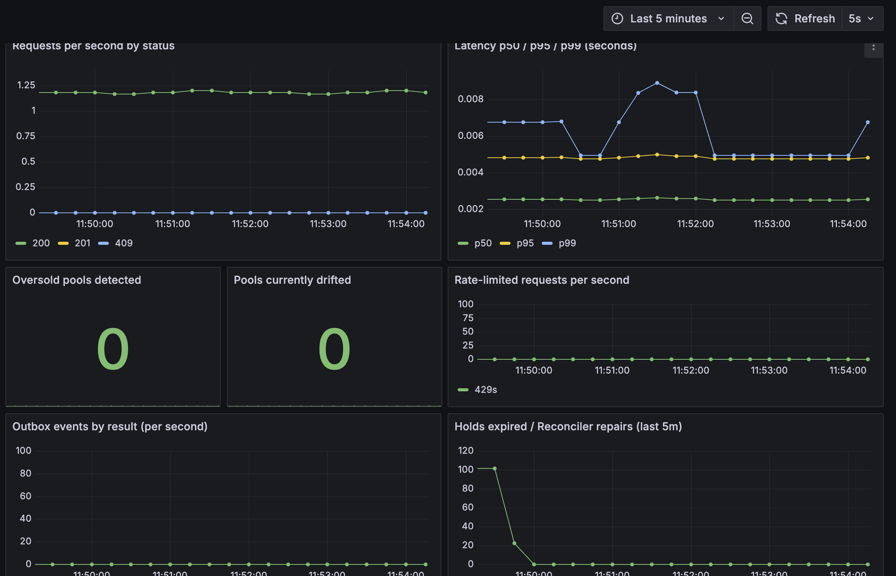
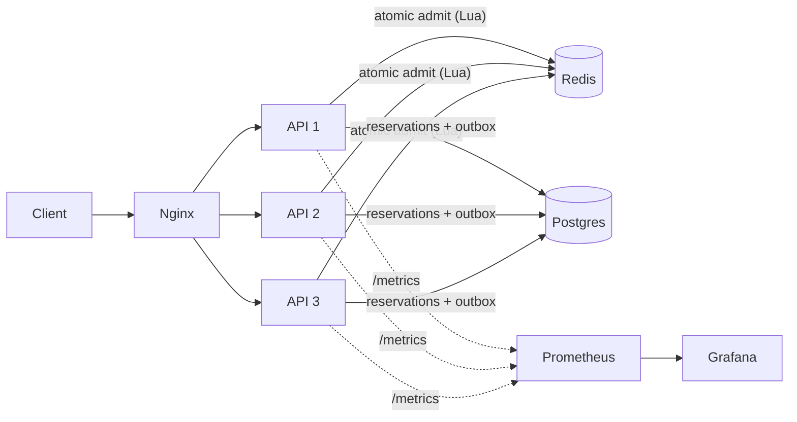

# Surge

A reservation API for limited-capacity pools (tickets, seats, drops) that **never sells more than it has**, even when hundreds of requests arrive at the same instant across several server instances.

## The proof

300 simultaneous reserve requests against a pool of 50, sent through Nginx to 3 API instances:

| | Requests | Result |
|---|---|---|
| Succeeded (`201`) | 50 | exactly the capacity |
| Rejected (`409` sold out) | 250 | |
| **Oversold units** | **0** | |
| Left in pool | 0 | |

Reproduce it:

```bash
docker compose up --build --scale api=3 -d
python loadtest/oversell.py
```

For contrast, the first version of this project (Postgres only, no admission gate) gave all 300 requests a unit against the same pool of 50: **250 units oversold**. Every later phase exists to fix that without giving up speed.



## How it works



Every API instance also runs three background loops: the **outbox worker**, the **hold-expiry worker**, and the **reconciler**.

**Reserving.** Redis makes the yes/no decision in one atomic Lua script (check the counter, then subtract), so two requests can never both take the last unit. Only admitted requests touch Postgres, which records the reservation as `HELD`. Requests for a sold-out pool are rejected in Redis and never reach the database.

**Releasing and expiring.** Postgres is the source of truth. A release (or an expired hold) changes the reservation's status and writes a "return one unit" event to an `outbox_events` table in the **same transaction**. The unit goes back to Redis through that event: first an immediate attempt, then a background worker that retries with exponential backoff. Redis remembers which event ids it has applied, so a delivery that is repeated, for example after a crash, adds the unit only once. An event that fails 8 times moves to a dead-letter state and can be inspected and requeued.

**Repairing drift.** The reconciler recomputes what each Redis counter should be (`capacity − active reservations − undelivered returns`) and repairs a mismatch only after it has seen the *same* mismatch on two consecutive passes, because a request caught between its Redis step and its Postgres step looks identical to drift for a few milliseconds. A counter that has vanished is rebuilt immediately.

**Fairness.** Admission order is whatever order requests reach Redis (first come, first served). A per-requester rate limit (default 10 requests per 60 seconds) returns `429` with `Retry-After`.

## What happens when something fails

| Failure | Result |
|---|---|
| Postgres insert fails after Redis admitted | The unit is handed back to Redis before the error is returned |
| That give-back also fails | The original error still reaches the caller; the reconciler repairs the counter |
| Redis fails while releasing | The release still succeeds; the outbox delivers the unit later |
| Outbox delivery repeated (worker crash) | Applied once, via the per-event marker in Redis |
| Redis counter lost | Rebuilt from Postgres. It is never invented from nothing, so this fails toward selling too little, not too much |
| Client retries a request | Same `Idempotency-Key` returns the original response instead of reserving again |
| Hold never confirmed | Expires after `HOLD_TTL_SECONDS` (default 900) and the unit returns through the outbox |

## API

| Method | Path | Notes |
|---|---|---|
| `POST` | `/pools` | `{"name": "...", "capacity": 50}` |
| `GET` | `/pools/{id}/availability` | |
| `POST` | `/pools/{id}/reserve` | Body `{"requester_id": "..."}`; **`Idempotency-Key` header required** (`422` if missing). `201` held, `409` sold out or duplicate in progress, `404` unknown pool, `429` rate limited |
| `POST` | `/reservations/{id}/confirm` | `409` if not currently `HELD` |
| `POST` | `/reservations/{id}/release` | `409` if not currently `HELD` |
| `GET` | `/healthz` | |
| `GET` | `/metrics` | Prometheus; blocked at Nginx, scraped internally |
| `GET` | `/admin/outbox/failed` | Dead-lettered events; **no authentication**, blocked at Nginx |
| `POST` | `/admin/outbox/{id}/requeue` | Same |

Reservation states: `HELD → CONFIRMED`, `HELD → RELEASED`, `HELD → EXPIRED`.

## Running it

Requires Docker, and a Postgres database (the project was developed against Neon).

```bash
cp .env.example .env        # fill in DATABASE_URL and the TEST_* values
python -m app.db.init_db    # create the tables
docker compose up --build --scale api=3 -d
```

| URL | What |
|---|---|
| http://localhost:8080 | The API (through Nginx) |
| http://localhost:9090/targets | Prometheus, one target per instance |
| http://localhost:3000 | Grafana, "Surge" dashboard (no login; local use only) |

After changing `--scale`, run `docker compose restart nginx` so it picks up the new instances.

### Configuration

| Variable | Default | Purpose |
|---|---|---|
| `DATABASE_URL` | required | Postgres connection |
| `REDIS_URL` | required | Redis connection |
| `TEST_DATABASE_URL`, `TEST_REDIS_URL` | required for tests | Must differ from the above. The test suite wipes them, and refuses to run if the Redis URLs match |
| `HOLD_TTL_SECONDS` | 900 | How long an unconfirmed hold lasts |
| `RATE_LIMIT_ENABLED`, `RATE_LIMIT_REQUESTS`, `RATE_LIMIT_WINDOW_SECONDS` | true, 10, 60 | Per-requester limit on reserve |
| `OUTBOX_POLL_INTERVAL_SECONDS`, `OUTBOX_BATCH_SIZE`, `OUTBOX_MAX_ATTEMPTS` | 0.5, 50, 8 | Outbox worker |
| `RECONCILE_ENABLED`, `RECONCILE_INTERVAL_SECONDS` | true, 30 | Reconciler |

Set `RATE_LIMIT_ENABLED=false` for load tests that reuse requester ids.

## Tests

```bash
pytest                                              # 38 tests, includes failure injection
pytest -m slow -s tests/concurrency/test_oversell.py   # the 300-vs-50 proof
```

The suite covers the full API, the outbox (including a repeated delivery adding the unit once, retry after a failed delivery, dead-lettering and requeue), hold expiry, every reconciler rule, and the rate limiter. Failures are injected by swapping in classes that make Postgres or Redis fail on purpose. CI (`.github/workflows/ci.yml`) runs all of it, plus the oversell proof, against fresh Postgres and Redis containers.

## Benchmark

Run on a single laptop (the load generator, Docker, Nginx, and 3 API instances
share it) against a remote Postgres on Neon, so the numbers below are a
floor, not a ceiling. Each figure is the median of 3 runs. Every run
ended with 0 oversold units.

| Scenario | Requests / capacity / concurrency | Throughput | Latency p50 / p95 / p99 |
|---|---|---|---|
| Most buyers turned away | 5000 / 500 / 100 | 259 req/s | 136 / 1791 / 2178 ms |
| — the 500 successes only | | | 1718 / 1967 / 2016 ms |
| — the 4500 rejections only | | | 116 / 874 / 2248 ms |
| Everyone succeeds (every request inserts) | 1000 / 1000 / 50 | 55 req/s | 906 / 1053 / 1113 ms |
| After sell-out (rejections only) | 20000 / 500 / 100 | _fill in_ | _fill in_ |

The successful path is bounded by the Postgres insert (a network round trip to
a remote database). The rejection path never touches Postgres. For comparison,
the first Postgres-only version of this project oversold 250 of 300 units on
the same test.

## Known limitations

- **Redis is a single node** with append-only persistence. There is no failover. If it is lost, the reconciler rebuilds counters from Postgres, but admissions stop until then.
- **`/admin` has no authentication.** Nginx blocks it from outside; do not expose it directly.
- **The rate limiter is a fixed window**, so a requester can briefly burst up to twice the limit across a window boundary.
- **Idempotency records last 24 hours** in Redis. They are not permanent.
- **One narrow double-count case.** If Redis is fully flushed while an outbox event that was already applied is still marked pending, redelivery could add that unit twice. The reconciler would flag the resulting drift.
- **A cap on active reservations per requester is not implemented.** It touches release, expiry, and reconciliation and needs a policy decision (does a confirmed reservation count?).
- The `idempotency_keys` table from an earlier phase is unused and can be dropped.

## Layout

```
app/
  api/             routes, dependencies, error mapping
  core/            business logic: admission, reservations, pools, outbox,
                   reconciliation, fairness, idempotency
  db/              schema.sql, pool creation, init script
  observability/   Prometheus metrics
deploy/            nginx, prometheus, grafana provisioning and dashboard
loadtest/          oversell.py
tests/             api/, unit/, concurrency/
```